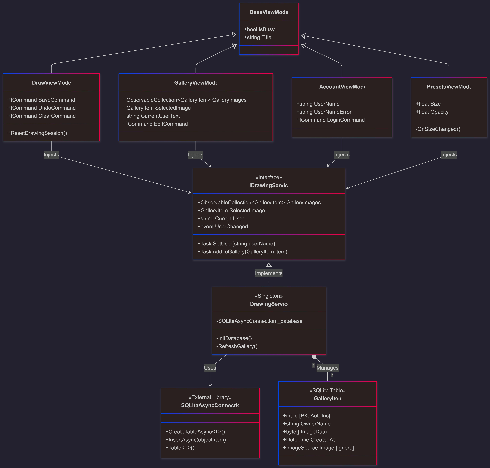
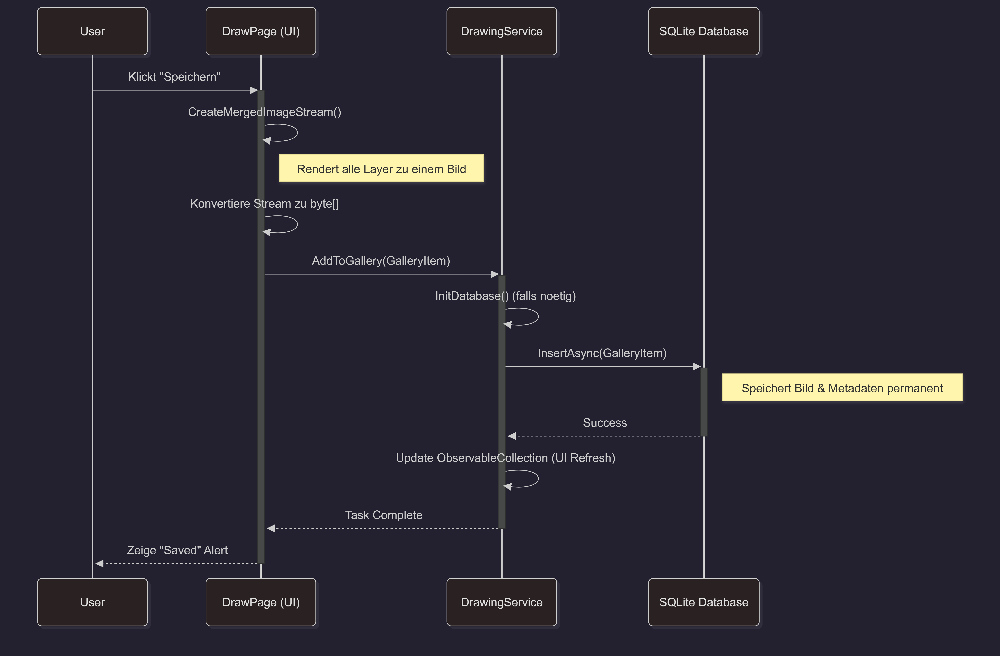
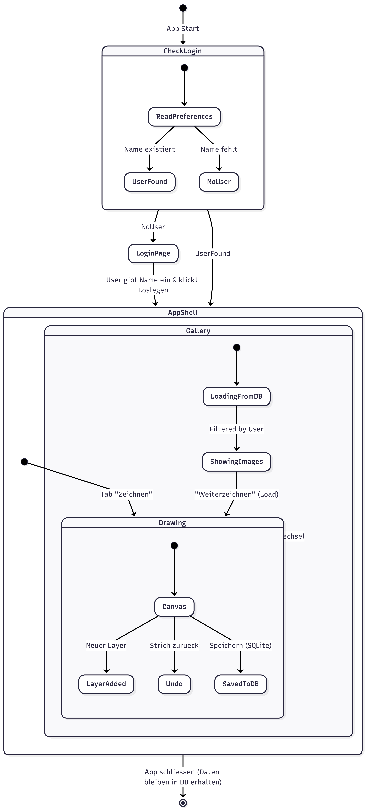

# MauiPaint - No Bullshit Painting.

A minimal, robust .NET MAUI painting application. Focuses on core functionality: drawing, layers, and persistence. 

Built for users who just want to draw. No bloat.

## Features
- **Layers:** Add, switch, and merge layers seamlessly.
- **Persistence:** SQLite integration ensures your work survives app restarts.
- **User Sessions:** Simple name-based login to separate workspaces.
- **Undo/Redo:** Basic history management.
- **Dark Mode:** Easy on the eyes.

## Build
```bash
dotnet build
dotnet run
```

## Architecture
Diagrams for the visually inclined.

### Class Diagram
Architecture overview. Singleton Service, ViewModels, SQLite Model.


### Save Process (Sequence)
Data flow from Canvas to SQLite Database.


### App Lifecycle (State)
Application states from Login to Persistent Storage.


## License
MIT. Do whatever.